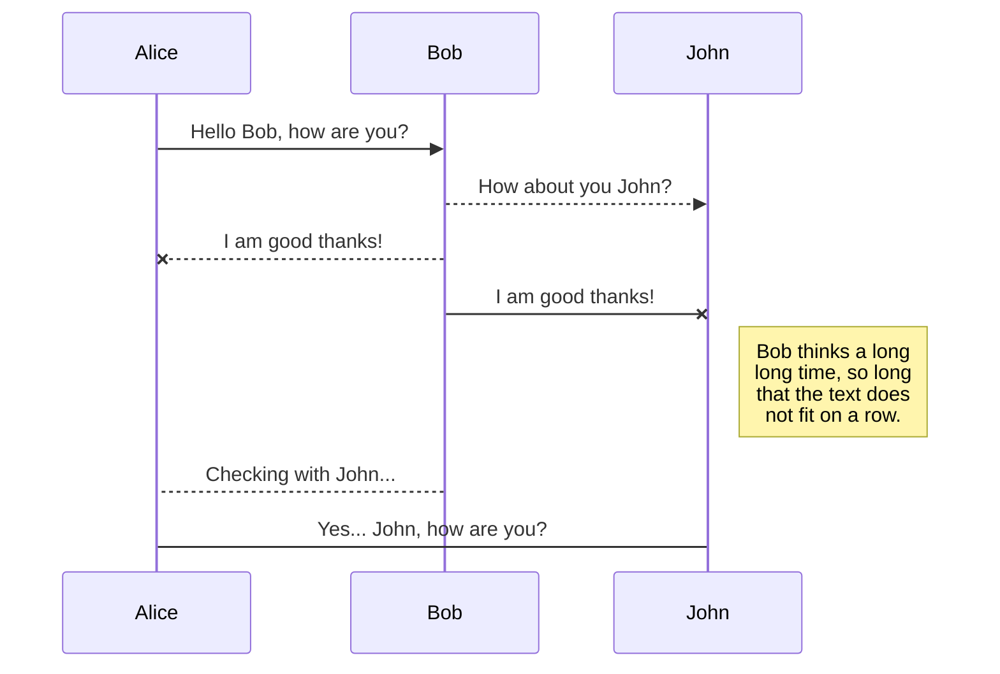
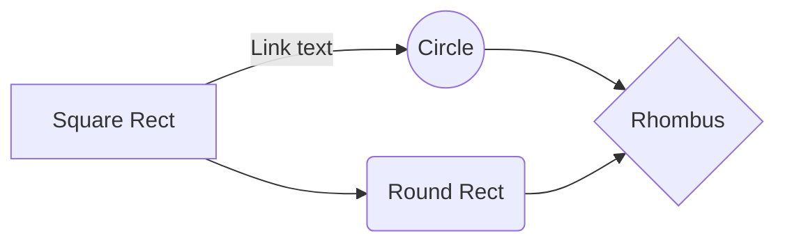

## Purpose

This envoyfilter limits connection to a particular port in your istio workload. Will be useful if workload pods are not able to handle more than a certain number of connections, for whatever reasons - may be a code limitation or the CPU/MEM resources given to it is just enough for a certain number of clients.

## Explanation

## How to test it

Apply the Envoyfilter given in this directory to your bookinfo namespace. Expose the bookinfo productpage as  a loadbalancer. Since I am using a kind cluster, I am not short of LB addresses.

### Adding downstream & upstream stats to envoy sidecar
Edit deployment for workload with istio injection enabled. 
Spec > template > metadata > annotations 

    template:
      metadata:
        annotations:
          prometheus.io/path: /metrics
          prometheus.io/port: "9080"
          prometheus.io/scrape: "true"
          proxy.istio.io/config: |
            proxyStatsMatcher:
             inclusionRegexps:
              - ".*downstream_.*"
              - ".*upstream_.*"

##  diagrams

You can render UML diagrams using [Mermaid](https://mermaidjs.github.io/). For example, this will produce a sequence diagram:

And this will produce a flow chart:

